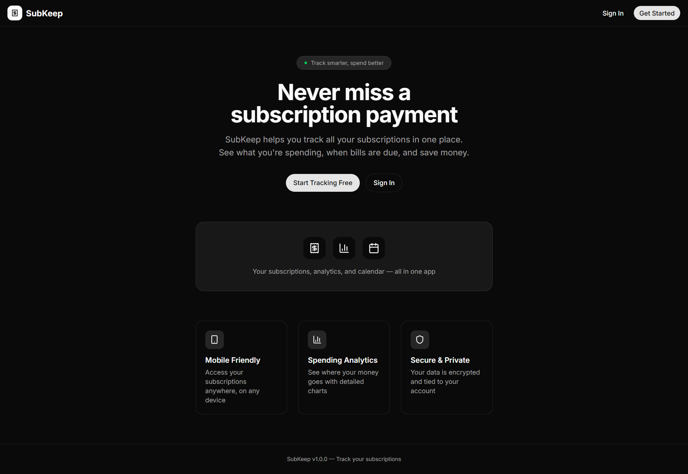
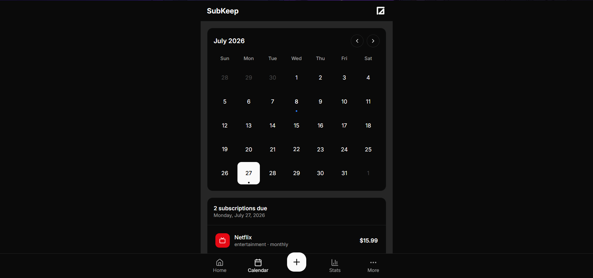
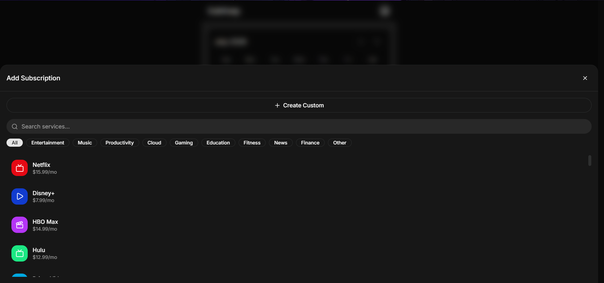
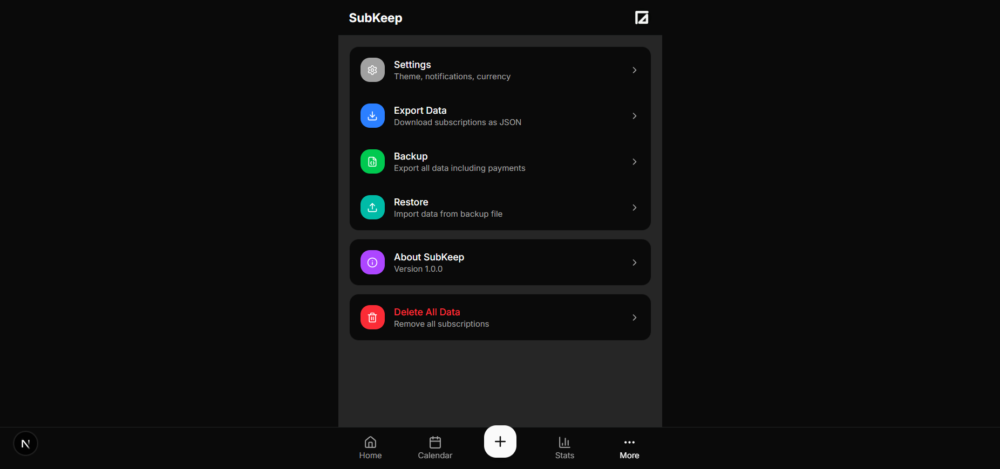

# SubKeep (v1.0.0)

SubKeep is a sleek, modern subscription tracker that helps you manage recurring expenses, track account credentials and billing cycles, project payment schedules, and visualize monthly spending analytics in one clean dashboard.

---

## Project Screenshots

<details>
<summary>Click to expand / collapse project screenshots</summary>
<br />

| Landing Page | Main Dashboard |
| :---: | :---: |
|  |  |

| Calendar Billing Projections | Custom Subscription & Fast Icon Search |
| :---: | :---: |
|  |  |

| Spending Analytics & Trends | Settings & Backups |
| :---: | :---: |
|  |  |

</details>

---

## Applications & Structure

This repository is structured as a self-contained monorepo:

```text
apps/
└── web/        # SubKeep Web App (Next.js 16 + Convex + Clerk + Tailwind CSS v4)
```

For full setup details, environment configuration, and features, see [apps/web/README.md](./apps/web/README.md).

---

## Quick Start

```bash
# 1. Go to the web app
cd apps/web

# 2. Install dependencies
npm install

# 3. Start Convex backend & Next.js dev server
npx convex dev
npm run dev
```

---

## License

[MIT](LICENSE)
