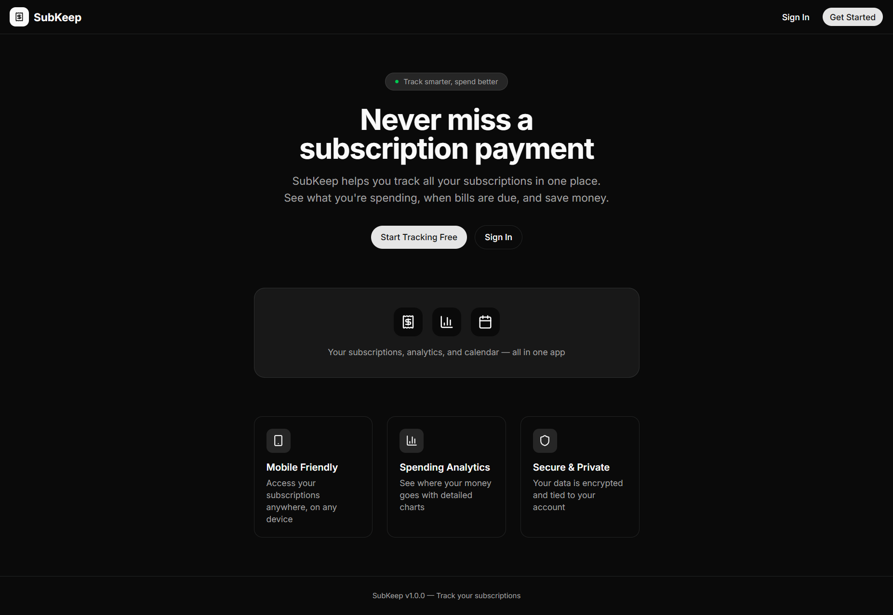
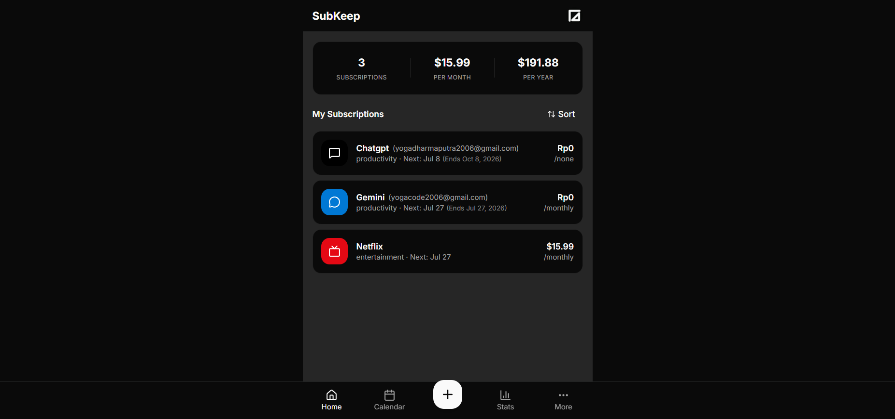
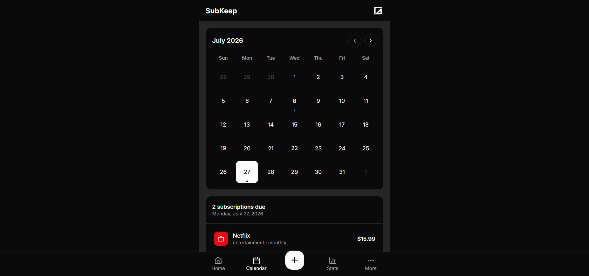
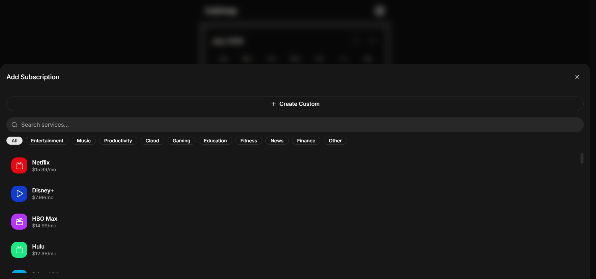
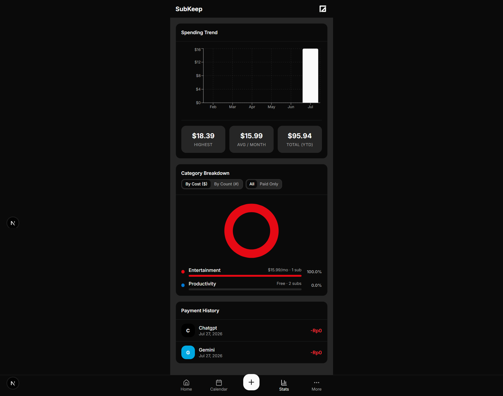
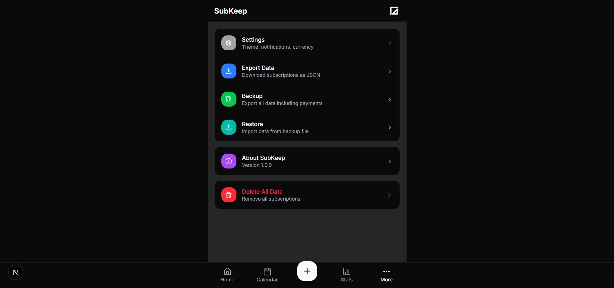

# SubKeep (v0.1.0)

SubKeep is a sleek, modern personal finance tracker that helps you log expenses and income, set category budgets, track account balances and net worth, and manage subscriptions — recurring billing cycles, trials, payment schedules, and monthly spending analytics — in one clean dashboard.

---

## Project Screenshots

<details>
<summary>Click to expand / collapse project screenshots</summary>
<br />

| Landing Page | Main Dashboard |
| :---: | :---: |
|  |  |

| Calendar Billing Projections | Custom Subscription & Fast Icon Search |
| :---: | :---: |
|  |  |

| Spending Analytics & Trends | Settings & Backups |
| :---: | :---: |
|  |  |

</details>

---

## Applications & Structure

Each application in `apps/` is self-contained with its own dependencies
and `pnpm-lock.yaml` — install and run commands inside each app directory:

```text
subkeep/
├── apps/
│   ├── website/    # SubKeep Web App (Next.js 16 + Convex + Clerk + Tailwind CSS v4)
│   ├── mobile/     # SubKeep Mobile App (Expo SDK 54 + Convex + Clerk)
│   ├── desktop/    # SubKeep Desktop App (Electron + Vite + Convex + Clerk)
├── docker/         # Docker orchestration configurations
├── docs/           # Architecture & technical documentation
└── scripts/        # Utility automation scripts
```

For full setup details, environment configuration, and features, see [apps/website/README.md](./apps/website/README.md).

---

## Quick Start

```bash
cd apps/website
pnpm install
pnpm dlx convex dev
pnpm dev
```

---

## License

[MIT](LICENSE)
