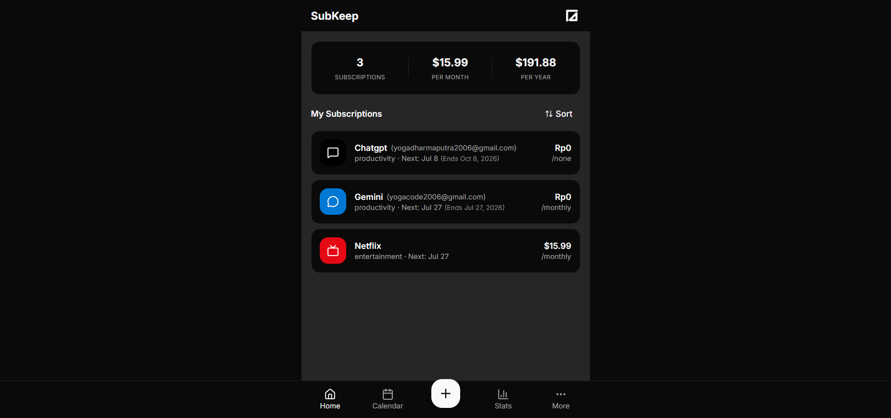
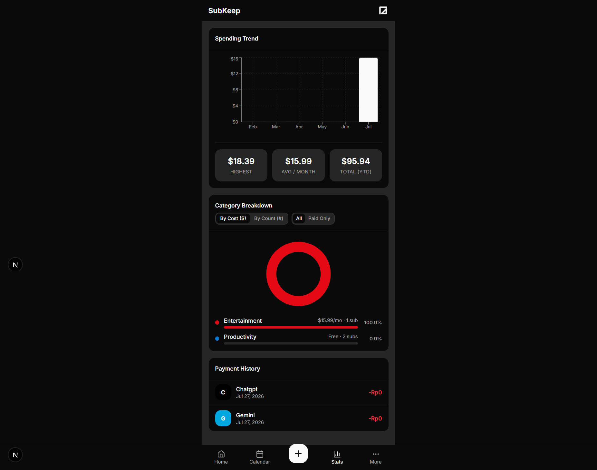

# SubKeep (v0.0.1)

A sleek, mobile-first subscription tracker built with Next.js 16, Convex, Clerk, and Tailwind CSS v4.

---

## Screenshots

<details>
<summary>Click to expand / collapse project screenshots</summary>
<br />

| Landing Page | Main Dashboard |
| :---: | :---: |
|  |  |

| Calendar Billing Projections | Custom Subscription & Fast Icon Search |
| :---: | :---: |
|  |  |

| Spending Analytics & Trends | Settings & Backups |
| :---: | :---: |
|  |  |

</details>

---

## Key Features

- **Subscription Management** — Add, edit, suspend, clone, and delete subscriptions with custom colors and icons.
- **Flexible Billing Cycles** — Support for Daily, Weekly, Monthly, **3 Months**, **6 Months**, Yearly, and **No Cycle / One-time** payments.
- **Start Date & End Date** — Track subscription start dates and optional end dates with automatic expiration handling.
- **Account & Website Links** — Track sub-accounts/emails (`user@gmail.com`) and direct clickable provider links (`netflix.com`).
- **Instant Icon Picker** — Sub-millisecond keyword search ("chat", "stream", "ai", "finance") powered by `useDeferredValue` and pre-indexed aliases across 1,500+ Lucide icons.
- **Start-Date Aware Trends** — Historical spending trend chart calculates monthly costs strictly based on active subscription date ranges.
- **Interactive Category Breakdown** — Toggle between **By Cost ($)** and **By Count (#)**, and filter between **All** or **Paid Only** subscriptions.
- **Calendar Projections** — Automatically projects recurring billing dates across any month and year.
- **50+ Pre-built Templates** — Quick setup for popular services (Netflix, Spotify, ChatGPT, iCloud, etc.).
- **Export, Backup & Restore** — Download JSON data backups and restore subscriptions effortlessly.
- **Automatic Dark / Light Mode** — Seamless theme detection and manual toggle via `next-themes`.

---

## Tech Stack

- **Framework:** Next.js 16 (App Router & Turbopack)
- **Database:** Convex (real-time backend & mutations)
- **Auth:** Clerk
- **Styling:** Tailwind CSS v4 + shadcn/ui
- **Charts:** Recharts
- **Icons:** Lucide React (`lucide-react/dynamicIconImports` code-split dynamic renderer)

---

## Getting Started

### Prerequisites

- Node.js 18+
- A [Convex](https://convex.dev) account
- A [Clerk](https://clerk.com) account

### Setup

1. Install dependencies:

```bash
npm install
```

2. Set up environment variables in `.env.local`:

```env
# Convex
CONVEX_DEPLOYMENT=dev:<your-deployment-id>
NEXT_PUBLIC_CONVEX_URL=https://<your-deployment-id>.convex.cloud

# Clerk
NEXT_PUBLIC_CLERK_PUBLISHABLE_KEY=pk_test_...
CLERK_SECRET_KEY=sk_test_...
```

3. Push Convex schema and start Convex dev server:

```bash
npx convex dev
```

4. Start the Next.js dev server:

```bash
npm run dev
```

---

## Scripts

| Command | Description |
|---|---|
| `npm run dev` | Start Next.js development server |
| `npm run build` | Build optimized production bundle |
| `npm run start` | Start production server |
| `npm run typecheck` | Run TypeScript type checking |
| `npm run lint` | Run ESLint check |
| `npm run format` | Format files with Prettier |

---

## Project Structure

```
app/
  (auth)/           # Clerk sign-in / sign-up pages
  (dashboard)/      # Main application routes
    page.tsx        # Dashboard (spending summary & subscription list)
    calendar/       # Calendar view with projected billing dates
    stats/          # Spending trend & interactive category breakdown
    more/           # Settings, backups, export & restore
    subscriptions/  # Subscription detail (edit, account, website, clone, delete)
  layout.tsx        # Root layout (Clerk, Convex, NextThemes providers)
convex/
  schema.ts         # Database schema (subscriptions, templates, payments)
  subscriptions.ts  # CRUD mutations & stats calculations
  templates.ts      # Pre-built templates seed data
  payments.ts       # Payment history tracking
components/
  dynamic-icon.tsx  # Code-split dynamic icon renderer
  icon-picker.tsx   # Lag-free keyword icon search picker
  stats-charts.tsx  # Spending trend & category breakdown charts
  calendar-grid.tsx # Calendar recurrence projection engine
```
